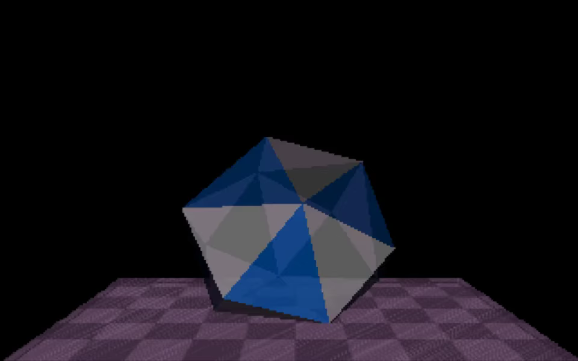
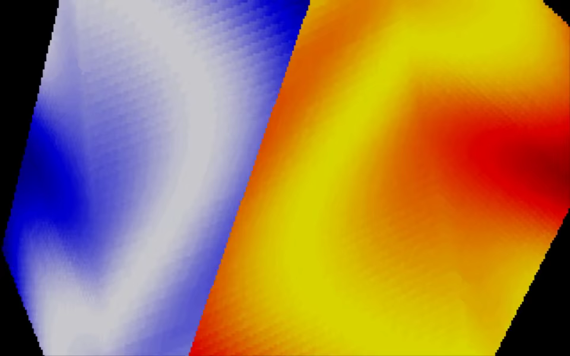
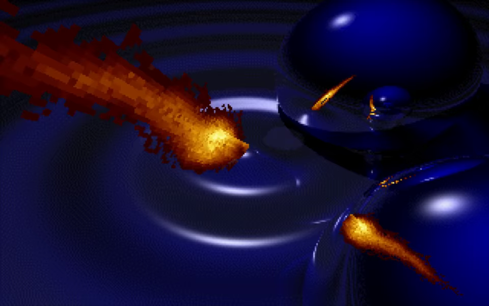
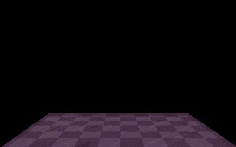

# Second Reality Go

<!-- Project showcase -->
## Screenshots

Transparent faceted solids above a shaded checkerboard.

A rotating cube covered in animated color plasma.

Reflective spheres and fire streaks over rippling water.

## Video

**[Watch or download the 24-second MP4 preview with sound](https://github.com/olivierh59500/go-secondreality/raw/refs/heads/main/docs/media/preview.mp4)**

This short showcase combines selected passages from the Go production.

The animated image is silent; the MP4 includes the soundtrack.

<!-- End project showcase -->

## Optional DCK version

The original implementation remains at its original paths. Run it with `go run ./cmd/secondreality`.

The construction-kit version is in [dck/](dck/README.md). Run `go run ./dck/cmd/secondreality` from this directory. Both versions share the original assets.

The DCK version opens the bundled soundtrack through `sound.Open` with a track
index and starting order. DCK selects the timing-compatible replay inside
`go-zikmu`; the demo reads audible order, row and frame markers through DCK.
The local DCK copy of the replay engine has been removed. Regression tests
compare PCM and synchronization markers with the original implementation.
